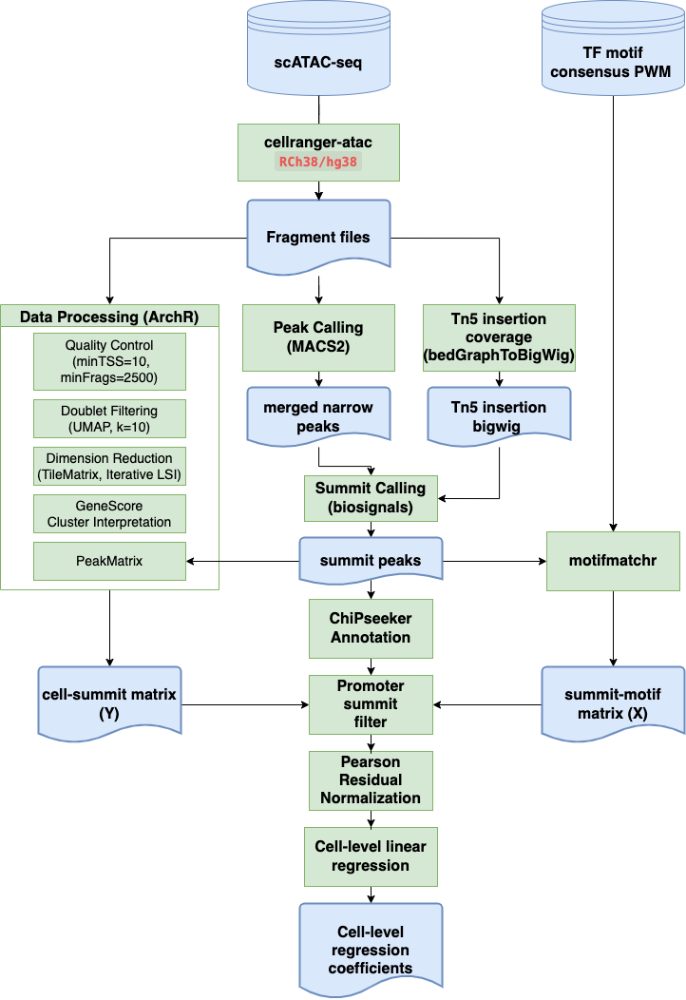

# sc-atac-submmit-calling

## Pipeline overview 

### Dependencies

* archR
* macs2
* motifmatchr
* biosignals
* deepTools

### scripts
1. ArchR based preprocessing and macs2 based bulk peak calling: [1_ArchR_data_processing.ipynb](1_ArchR_data_processing.ipynb)
2. deepTools and Samtools based data preparation: [2_prepare_submit_calling_files.sh](2_prepare_submit_calling_files.sh)
3. biosignals based summit calling: [3_extract_peak_summits.ipynb](3_extract_peak_summits.ipynb)
4. motifmachr based motif searching: [4_4_match_motifs.ipynb](4_match_motifs.ipynb)
